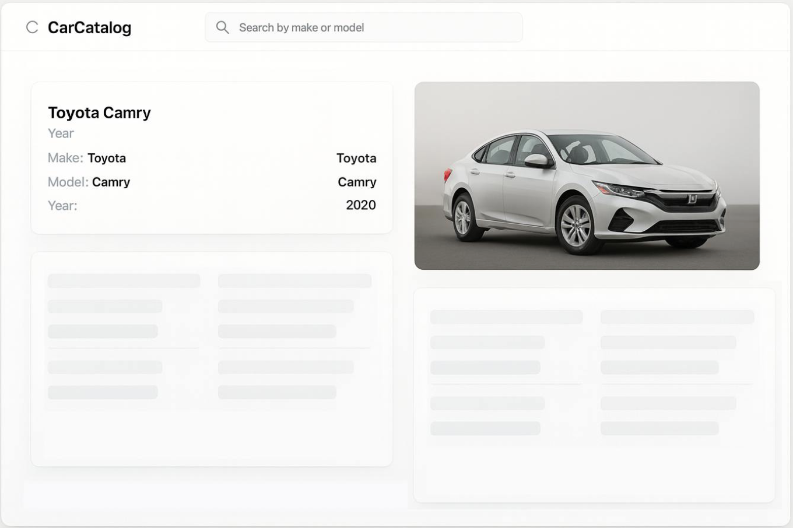

# Задание

## Мини-каталог автомобилей

### Цель

1. Разработать мини-приложение на Vue 3 для отображения каталога автомобилей с использованием локального JSON и внешнего API для загрузки расширенной информации по каждому автомобилю.

### Задачи

1. Подготовка данных

   - Сгенерировать с помощью AI локальный JSON файл с базовой информацией о 10-20 автомобилях (далее — ТС).
   - Возможный формат данных:

   ```ts
   [
     { id: 1, make: 'Toyota', model: 'Camry', year: 2020 },
     { id: 2, make: 'BMW', model: 'X5', year: 2019 },
   ];
   ```

2. Использование внешнего API

   - Подключить CarQuery API (https://www.carqueryapi.com/) для получения дополнительной информации о ТС.
   - Пример запроса: `https://www.carqueryapi.com/api/0.3/?cmd=getTrims&make=toyota&year=2020`

- Загружать данные динамически при открытии карточки автомобиля.

1. Страницы приложения
   1. Список автомобилей
      - Отображать список автомобилей из локального JSON.
      - Добавить локальный поиск по марке и модели.
      - Сделать клик по автомобилю для перехода на страницу карточки.
   2. Карточка автомобиля
      - Отображать основные данные из локального JSON.
      - При открытии страницы загружать расширенную информацию о ТС через CarQuery API.
      - Добавить прелоадер во время загрузки.В случае ошибки загрузки данных — отображать сообщение пользователю.

### Функциональные требования

- Локальный поиск по make и model.
- Переход между страницами списка и карточки автомобиля.
- Загрузка дополнительных данных при открытии карточки.
- Состояния загрузки и ошибок.

### Ограничения

- Технологии: взять все самое современное в экосистеме Vue
- Можно использовать любые CSS/Design фреймворки
- Сделать на nuxt с SSR + SPA + скрипты для генерации двух отдельных версий
- Локальный сгенерированный api сделать через nuxt serverИспользовать pinia для хранения всех данных (чтобы исключить повторные запросы за всеми jsonʼами) + сделать persistent хранилище
- Типизировать все через typescript
- Хорошо и вдумчиво организовать код - возможно применить какой-то стандарт
- Написать короткое README.md: что сделано/не сделано, как запустить, где что лежит

### Дополнительный плюс

- Найти какое-то дополнительное API для изображений ТС и делать еще загрузку фоток в карточке
- Использовать в проекте линтеры и другие code-quality инструменты
- Реализовать похожий дизайн (как на макете)
- Добавить блок с фильтрами на странице со списком. Фильтры взять по имеющимся данным по json (можно самостоятельно дополнить). Корректно применять фильтры на список. Сохранять фильтры в url строку и при обновлении страницы их восстанавливать.


